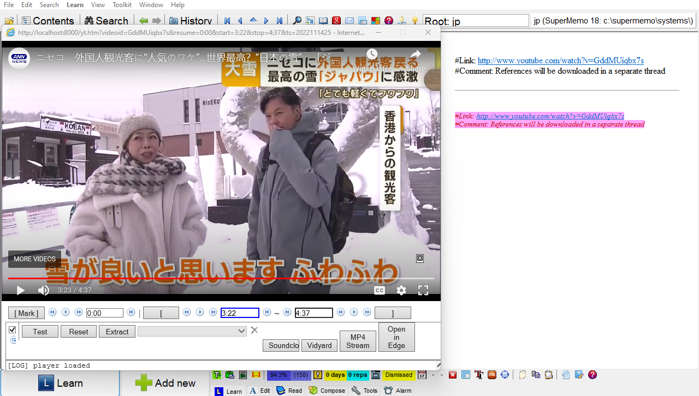

# SuperMemo YouTube React Extension 

SuperMemo YouTube extract performance improvements and extensions.

## Description

Fixes SuperMemo memleaks and slowdowns with a popup window. Utilize a locally hosted service to remove remote requirements saving up to 500ms per card and utilize the react-player to extend the functionality of incremental video in SM-18. I now consider this a beta and usable, it won't overwrite your cards under expected operation. However, I recommend that you [backup your collection](https://www.supermemo.wiki/en/supermemo/backup-guide) before starting to use this extension.



## Getting Started

### Dependencies

* python2 or 3
* SuperMemo 18
* Windows

### Installing

* Have you checked the files against the yt.htm in your install folder right? Otherwise someone could track what YT vids you're watching.

* Open the server folder in Terminal

* Start the server to host resources. Uses port 8000 by default.
```
python -m SimpleHTTPServer

OR

python3 -m http.server

```

* backup YouTube.htm in your install SuperMemo/bin folder

* if above succeeds, replace YouTube.htm to your installs SuperMemo/bin folder with the one provided in this ZIP

## Help

### One of my extract timestamps wiped!?

This can rarely happen if you hold ALT+LEFT or ALT+RIGHT and cycle theough many cards quickly. You may recover the times from the title of the card.

### The Player is too small, out of place, etc..

Adjust top, left, width and height in sep_embed to adjust screen placement.

### Server errors

Instead of using the python standard server, run serveit.py instead. Use the command 
```
python serveit.py 8000
```

### SecurityError

If you get a security error, you may need to increase the number of allowed connections in your browser. Link to a SO post for IE on how to do this for WebSockets: https://stackoverflow.com/a/56889101


### I'm not sure how to use this...

1. Download the zip off github, you'll have a SupermemoScripts zip file. 
2. Unzip it and go into SuperMemoScripts/YoutubeReactExtension. 
3. Copy YouTube.htm and paste it in C:/SuperMemo/bin, replacing the existing YouTube.htm. 
4. Go into the server folder in SuperMemoScripts/YoutubeReactExtension.
5. Hold shift key and right click, select the menu option "open in terminal". You might have to select the more options menu for it to appear. 
6. Enter python -m http.server 
7. If it says Python can't be found, install python from the Microsoft store and repeat from step 5, or try "py", " python3" instead of python.
Leave the terminal open and restart from step 4. every time you use SM

### Known bugs

- Closing a player with extracts on it and using the Reopen button will result in errors when making even more extracts.

### Differences with vanilla supermemo

- Extract background colour is lost (blue)
- Clicking fields inserts current time

## Version History

* 0.1
    * Mark/Stop/Start buttons work
    * Loading YouTube videos
    * Loads SM scripts locally
* 0.2
    * Nonblocking player and hotkeys
    * Playback speed slider
* 0.3 BETA
    * Bypass MEMLEAK in supermemo
    * Load external IE window with YT player
    * Changes reflect back to SM
    * Extracts and navigation work
    * Start, Stop, Mark textbox can be clicked to set times
    * Everything in the UI works
### Roadmap
* Title extract verification for timing overwrite error
* Pleasing layout
* Window fullscreen
* Serverside:
    * Store playback speeds
    * File-YT proxy for lightning fast plays
* More shortcuts such as fullscreen, extract setting using keys, etc...
* Visualize extracts on timeline
- Enter to OK
* SupermemoAssistant plugin to re-use player and make a YouTube Jukebox
* Browser plugin and YouTube player integration

## License

Inherits license in the root of the project.

## Acknowledgments

* [SuperMemo yt.htm](https://www.super-memory.com/)
